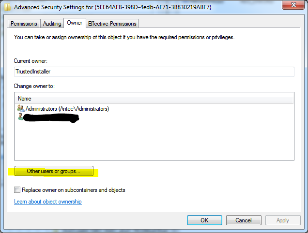

+++
categories = ["Windows"]
date = 2011-04-06T21:18:20Z
description = ""
draft = false
image = "FlFn-FVWAAYS8xH.jpg"
slug = "how-to-disable-low-memory-warnings-and-the-advantages-of-removing-the-page-file"
tags = ["Windows"]
title = "How to disable low memory warnings and the advantages of removing the page file"

+++

**Note: Orginally written in 2011; much of this advice no longer applies**

The page file, virtual memory, swap space – it has many names – is where the operating system places currently running programs and data when it either does not have enough RAM to store them in or it thinks they won't be used in the near future, so it preemptively frees RAM for new programs and data to be stored there.

With RAM continually getting cheaper per gigabyte 4, 6 and 8 Gb of RAM in a new desktop is not uncommon although more than 4 Gb in a notebook is still unusual. As such the need for extra virtual RAM stored on the much slower hard drive (or USB flash if using Windows Vista's or 7's ReadyBoost function) is increasingly unnecessary. I personally disable the page file as soon as I can get at least 4 Gb of RAM in a system for these reasons:

*   it frees up space on the hard drive that would otherwise be occupied by the page file
*   it reduces fragmentation on the hard drive caused by a growing and shrinking page file
*   all programs and data are always accessible in the fastest location – RAM. Windows has a tendency to move data to virtual memory even when there are still vast amounts of free RAM available
*   it speeds up reads and writes to the hard drive as it does not also have to cope with Windows writing out chunks of RAM to it while it is fetching or writing other data
*   it is essential if you are using a SSD as your sole means of permanent storage as the thrashing virtual memory gives will soon cause deterioration to the drive, due to the limited number of writes solid-state memory can withstand

Virtual memory was created for a reason however and there are disadvantages to disabling it. The most obvious one is that the number of programs the system can simultaneously support is reduced; on a 4 Gb Windows 7 system do not expected to run Photoshop, Dreamweaver and several browser tabs at once without running into trouble. The first trouble you will run into, under Windows 7 and possibly Vista is constant warnings when the system is using more than 80% of RAM.

Image source: [http://blogs.technet.com/b/markrussinovich](http://blogs.technet.com/b/markrussinovich/archive/2008/11/17/3155406.aspx?PageIndex=4) _Pushing the Limits of Windows: Virtual Memory_

Thankfully these can be disabled. Consider this: 80% usage for a 1 Gb system is 800 Mb, with only 200 Mb remaining, so warning the user that in 200 Mb usage the system will crash seems a good idea. However, with a 8 Gb system at 80% usage there is still 2 Gb remaining and typical usage may hover at 6.5 Gb, well within safety but the user will still be plagued with, in context, meaningless warnings.

**To disable low memory warnings, follow these steps:**

1.  We need to prevent the Diagnostics service from loading RADAR, which consists of 2 DLL files, radardt.dll and radarrs.dll
    Run Registry editor (Press \[Windows Key\] + R to launch the Run dialogue box, type _regedit_ and click OK)
2.  Go to:

		HKEY_LOCAL_MACHINE\SYSTEM\CurrentControlSet\Contro l\WDI\DiagnosticModules\{5EE64AFB-398D-4edb-AF71-3B830219ABF7}

3.  Right click the key and select _Permissions_

    

4.  Click the _Advanced_ button

    

5.  Click the _Owner_ tab and then the _Other users or groups…_ button

	

6.  In the _Enter the object name to select_ text area, enter _administrators_ or your current user name and click _OK_ repeatedly until returning back to the Registry Editor

	

7.  Repeat steps 3 – 6 for:

		HKEY_LOCAL_MACHINE\SYSTEM\CurrentControlSet\Contro l\WDI\DiagnosticModules\{45DE1EA9-10BC-4f96-9B21-4B6B83DBF476}

**References and further reading**

[_How to alter threshold low memory warning_](http://forum.xcpus.com/software/13082-how-alter-threshold-low-memory-warning-2.html)

[_Pushing the Limits of Windows: Virtual Memory_](http://blogs.technet.com/b/markrussinovich/archive/2008/11/17/3155406.aspx?PageIndex=4)