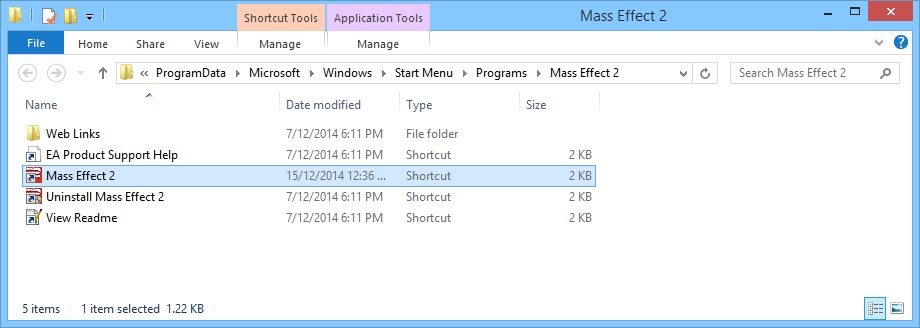
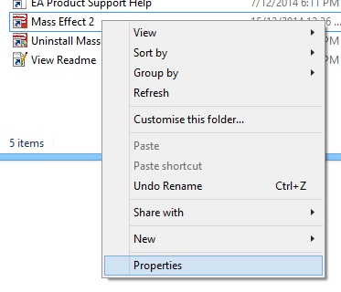
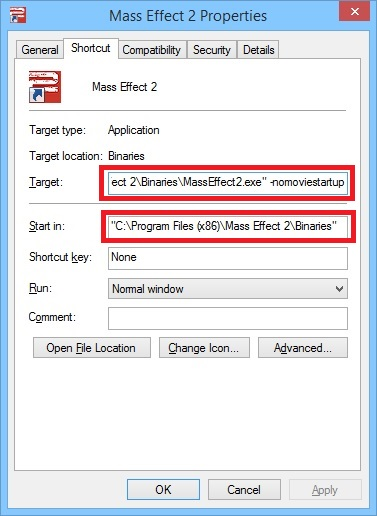
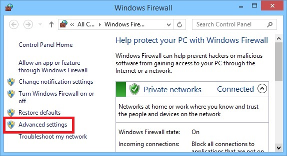
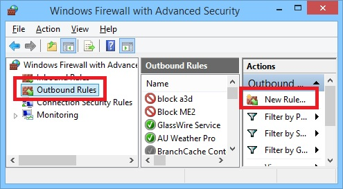
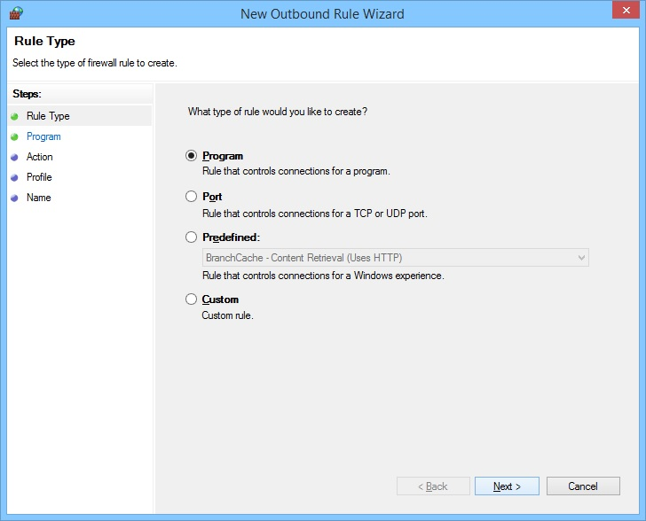
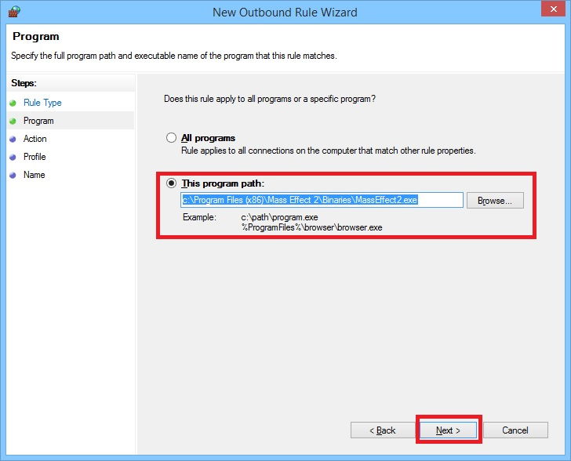
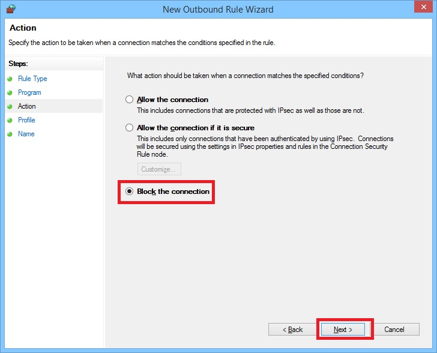
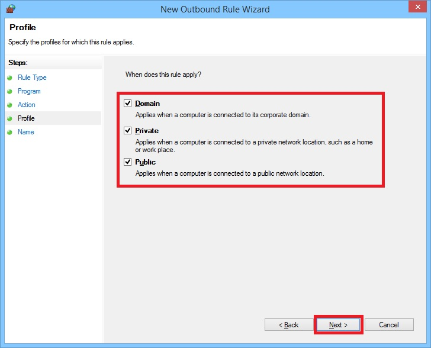
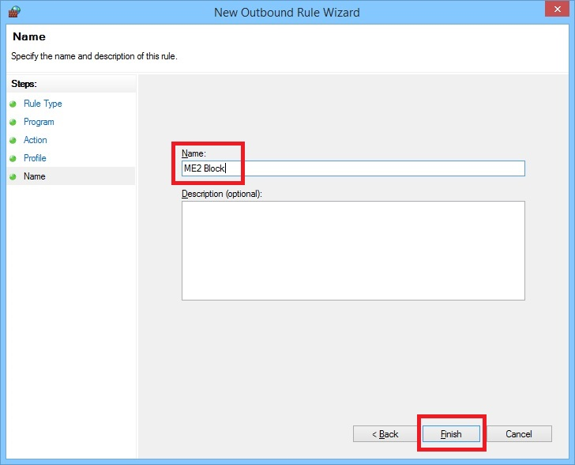

+++
date = 2014-12-15T12:21:20Z
description = ""
draft = false
image = "vintage-personal-computer-ads-13.jpg"
slug = "load-mass-effect-2-quickly"
title = "Skip Mass Effect 2 Intro Movies and Cerberus Network"

+++

**Note: These instructions were written for the orginal _Mass Effect 2_, not the remastered version**

Want to skip the opening movies and not have to wait for the Cerberus Network every time you start ME2? Easy, just requires two tweaks to your system (instructions for Windows only).

1\. Add the ```-nomoviestartup``` argument to your ME2 shortcut

a) Go to ```C:\ProgramData\Microsoft\Windows\Start Menu\Programs\Mass Effect 2``` to find your Mass Effect 2 shortcut



b) Right-click and select Properties



c) Change Target from (_including_ quotes: ```"```)

```"C:\Program Files (x86)\Mass Effect 2\MassEffect2Launcher.exe"```

to

```"C:\Program Files (x86)\Mass Effect 2\Binaries\MassEffect2.exe" -nomoviestartup```

and change Start in from

```"C:\Program Files (x86)\Mass Effect 2"```

to

```"C:\Program Files (x86)\Mass Effect 2\Binaries"```

then click OK



Now when you launch ME2 it should skip the Bioware and EA animated logos and go straight to Press a key on launch.

After this you still have to wait for ME2 to talk to the Internet before you can click the all important Resume. Let's fix that.

2\. Block ME2 from accessing the Internet in Windows Firewall

a) Go to the Control Panel and open Windows Firewall (eaisest way is to hit the <Windows> key on your keyboard, type 'Windows Firewall' and then hit <enter>), then click Advanced settings



b) Select Outbound Rules on the left, then click New Rule… on the right



c) Accept the default selection of Program and click Next



d) Enter the path as ```C:\Program Files (x86)\Mass Effect 2\Binaries\MassEffect2.exe```



e) Accept the default Block the connection and click Next



f) Accept the default of all networks and click Next



g) Give the new rule a name, e.g. ```ME2 Block```, and click Finish



Done! You should now be able to get back into your game as quickly as possible.
